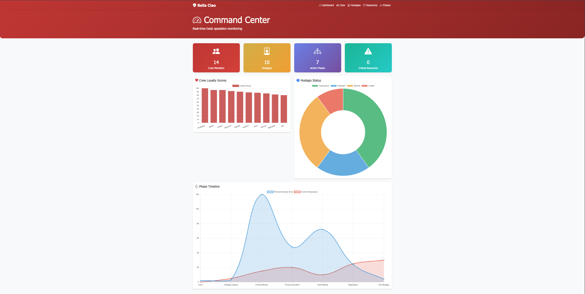
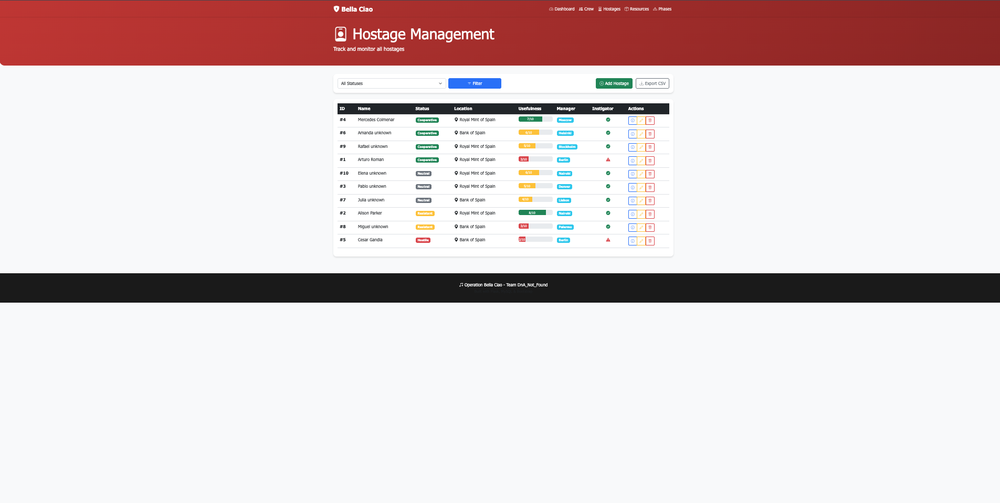
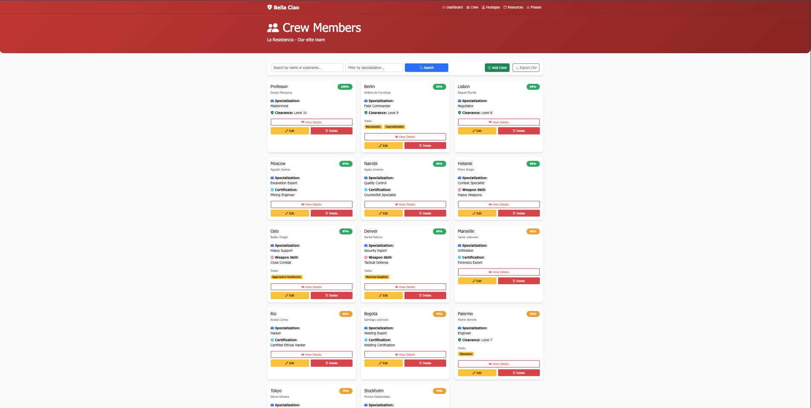
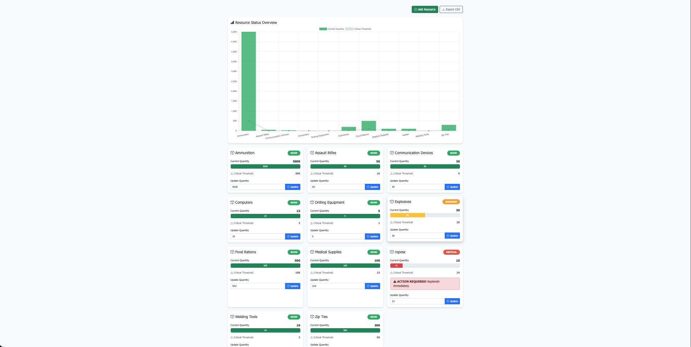
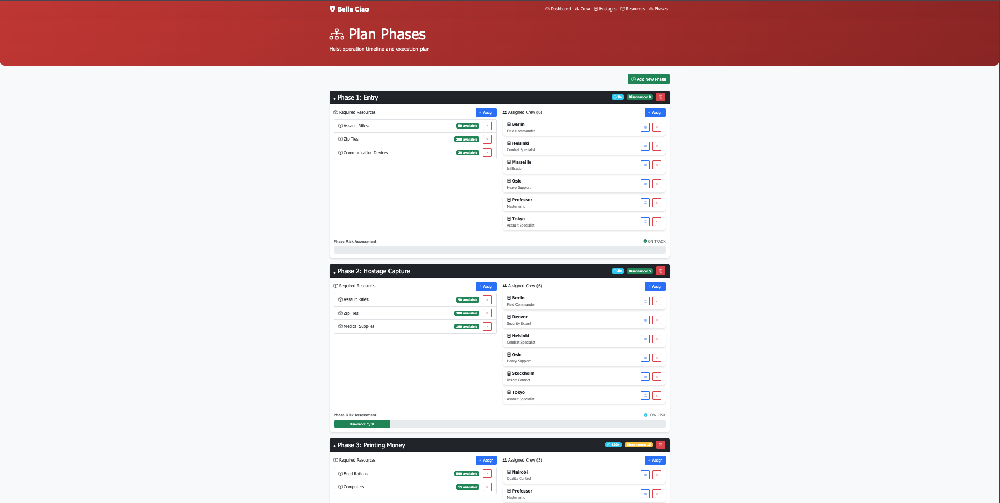

# Operation Bella Ciao – Heist Management System
 
A full-stack web application for managing a Money Heist–inspired operation: crew tracking, hostage monitoring, resource inventory, and phase planning, all backed by a normalized MySQL schema and visualized with interactive charts.
 
Built with Flask, MySQL, and Chart.js.
 

---
 
## Key Features
 
- **Interactive Dashboard** — real-time charts for crew loyalty distribution, hostage status breakdown, and resource health
- **Crew Management** — add, edit, and remove crew members with codenames, specializations, and loyalty scores
- **Hostage Tracking** — status monitoring (Cooperative / Neutral / Resistant / Hostile), usefulness scoring, and instigator flagging
- **Resource Monitoring** — color-coded critical/warning/good alerts, with AJAX inline quantity updates (no page reload)
- **Phase Timeline** — plan operation phases and assign crew members and resources to each one
- **CSV Export** — export crew, hostage, and resource data
- **Search & Filter** — quick lookup across crew and hostages
## Technologies
 
**Backend:** Python, Flask, PyMySQL
**Frontend:** HTML5, Jinja2, Bootstrap 5, Chart.js, vanilla JS (AJAX)
**Database:** MySQL, normalized schema (3NF)
**Architecture:** MVC pattern with RESTful endpoints
 
## Database Design
 
A normalized relational schema including:
- 12+ entities, including crew specialization hierarchy
- Weak entities (e.g. hostage interaction logs)
- Multi-valued and derived attributes
- Many-to-many relationships (phase ↔ crew, phase ↔ resources)
- Referential integrity with CASCADE constraints
- Auto-incrementing primary keys where IDs are system-generated (resources), explicit IDs where they're meaningful identifiers (crew codenames, hostage/phase numbers)
[View Full Schema](schema.sql)
 
---
 
## Screenshots
 
| Dashboard | Crew |
|---|---|
|  |  |
 
| Hostages | Resources |
|---|---|
|  |  |
 
| Phases |
|---|
|  |
 
---
 
## Quick Start (Local)
 
```bash
# Clone and set up
git clone https://github.com/<username>/bellaciao-heist-system.git
cd bellaciao-heist-system
python3 -m venv venv
source venv/bin/activate
pip install -r requirements.txt
 
# Database setup
mysql -u root -p -e "CREATE DATABASE bellaciao_db;"
mysql -u root -p bellaciao_db < schema.sql
mysql -u root -p bellaciao_db < populate.sql
 
# Configure environment
cp .env.example .env
# Edit .env with your MySQL credentials
 
# Run
python app.py
# Visit http://127.0.0.1:5000
```
 
### `.env` reference
 
```
DB_HOST=localhost
DB_USER=your_mysql_username
DB_PASSWORD=your_mysql_password
DB_NAME=bellaciao_db
SECRET_KEY=change-this-to-a-random-secret-key
```
 
---
 
## License
 
For educational purposes.
 